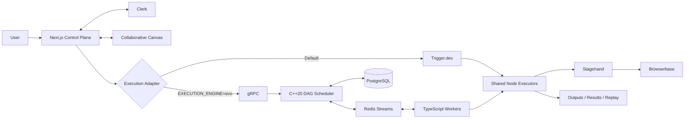
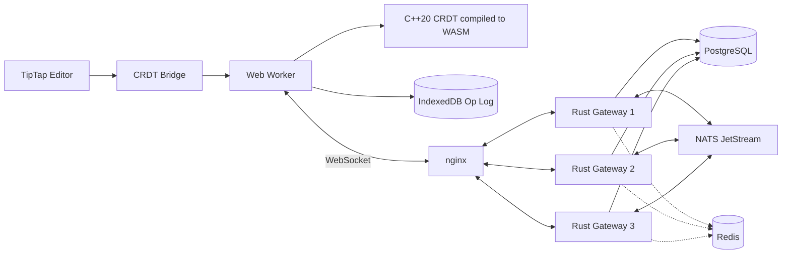

<div align="center">

# 👋 Hi, I'm Utkarsh Khajuria

### Software Engineer • GSoC'26 @ CGAL • Systems • Full-Stack • AI/ML

I build **developer tools, distributed systems, collaborative software, AI products, and high-performance C++/Python systems**.

<br/>


<br/>

[](https://github.com/UtkarsHMer05)
[](https://www.linkedin.com/in/utkarshkhajuria05)
[](mailto:utkarshkhajuria55@gmail.com)
[](https://instagram.com/utkarshk_05)

<br/>


</div>

---

<p align="center">
  <a href="#-about-me">About</a> •
  <a href="#-flagship-projects">Flagship Projects</a> •
  <a href="#-open-source--research">Open Source</a> •
  <a href="#-more-projects">More Projects</a> •
  <a href="#-technical-toolbox">Tech Stack</a> •
  <a href="#-achievements">Achievements</a> •
  <a href="#-connect-with-me">Contact</a>
</p>

---

# 👨‍💻 About Me

I'm a **Computer Science Engineering student** interested in building software where the interesting problems are deeper than the UI.

I enjoy working across the stack — from **C++ schedulers, CRDTs, concurrency and distributed systems** to **AI agents, full-stack products, cloud infrastructure and developer tooling**.

```text
🌐  Google Summer of Code 2026 Contributor @ CGAL
🔬  Former Technical Research Intern @ CSIR-IIIM
🧠  AI/ML + multimodal deep-learning experience
⚙️  C++ / Python / TypeScript / Rust
🏗️  Distributed systems, backend engineering & developer tools
🚀  I like building projects that force me to learn the layer underneath
```

- 🔭 **Main flagship project:** [EvoBrowser](https://github.com/UtkarsHMer05/EvoBrowser)
- 🧩 **Second flagship project:** [Concord](https://github.com/UtkarsHMer05/Concord-Dev)
- 🌐 **Open source:** CGAL Python Bindings through **Google Summer of Code 2026**
- 🌱 **Currently going deeper into:** distributed systems, concurrency, multithreading, Rust and systems design
- 💬 **Ask me about:** C++, Python, DSA, CGAL, browser automation, CRDTs, AI systems, full-stack engineering and open source
- 📫 **Reach me:** [utkarshkhajuria55@gmail.com](mailto:utkarshkhajuria55@gmail.com)

---

# 🚀 Flagship Projects

## 🥇 EvoBrowser — AI-Planned Collaborative Browser Automation

> **My primary flagship project.**  
> A browser-automation platform that combines an AI workflow builder with a real-time collaborative canvas and a second execution path powered by a custom **C++20 distributed workflow engine**.

<p>
  <a href="https://github.com/UtkarsHMer05/EvoBrowser">
    
  </a>
  <a href="https://evo-browser-nine.vercel.app">
    
  </a>
</p>


<br/>

<p align="center">
  
</p>

### What it does

A user describes an automation goal in natural language. EvoBrowser plans a structured workflow, places it on an editable multiplayer canvas, validates it, executes it inside a cloud browser, streams progress back to the UI, and preserves outputs, screenshots and session replay.

The system intentionally supports **two execution architectures**:

| | Phase 1 — Product Runtime | Phase 2 — Evo Engine |
|---|---|---|
| **Scheduler** | Trigger.dev durable task | Custom C++20 dependency-aware DAG scheduler |
| **Execution** | Sequential topological order | Concurrent execution of independent ready branches |
| **Transport** | Trigger.dev runtime | Redis Streams |
| **Control** | Application adapter | Protobuf + gRPC |
| **Durable engine state** | Trigger.dev + app artifacts | PostgreSQL |
| **Workers** | Shared node executors | TypeScript worker runtime |
| **Browser semantics** | One cloud session/run | Same-run browser affinity + serialization |
| **Recovery** | Trigger-managed | Leases, retries, reconciliation & idempotency |

### Engineering highlights

- 🧠 **AI workflow planning** with schema + semantic validation
- 🧩 **Editable visual DAG** using React Flow
- 👥 **Real-time collaboration** with shared graph state, presence and cursors
- 🌐 **Browser automation** using Stagehand V3 inside Browserbase sessions
- 👁️ **Live browser viewing** while an automation is executing
- 🎬 **Run replay**, screenshots, extracted results and per-node outputs
- ⚙️ **C++20 concurrent DAG scheduler**
- 📬 **Redis Streams** task/result/control/event transport
- 🗃️ **PostgreSQL authoritative run state**
- 🔁 Retry, backoff, jitter, leases, recovery and dead-letter behavior
- 🧷 Idempotent terminal result handling
- 🛑 End-to-end cancellation propagation
- ⚖️ Optional multi-tenant quotas, backpressure and weighted fairness
- 🔐 Organization-scoped authorization and entitlement checks

<details>
<summary><b>🏗️ Open EvoBrowser architecture</b></summary>



The important part is that the **UI and workflow contract stay engine-neutral**. The product can execute through the default durable runtime or through the custom distributed engine without changing the user-facing workflow model.

</details>

<details>
<summary><b>🧠 Why I built the custom Evo engine</b></summary>

The second execution path was built to explore the systems problems hidden underneath workflow automation:

- dependency-aware scheduling
- concurrent DAG execution
- same-resource affinity
- at-least-once delivery
- idempotency
- worker leases
- scheduler recovery
- cancellation propagation
- distributed state reconciliation
- multi-tenant fairness
- observability and failure handling

That makes EvoBrowser more than an AI UI around browser automation — it is also a systems project centered on **scheduling, concurrency and distributed execution**.

</details>

---

## 🥈 Concord — Local-First Collaborative Document System

> **My second flagship project.**  
> A Google-Docs-class collaboration system where the synchronization engine is built from scratch instead of relying on a collaboration SaaS.

<p>
  <a href="https://github.com/UtkarsHMer05/Concord-Dev">
    
  </a>
  <a href="https://concord-dev.vercel.app">
    
  </a>
</p>


### What makes it interesting

Concord treats the editor as the easy part. The actual project is the synchronization and reliability layer underneath it:

- 🧬 **Sequence CRDT in C++20**, compiled to both native code and WebAssembly
- 🦀 **Rust/Tokio WebSocket gateways**
- 💾 **PostgreSQL as durable truth**
- 📨 **NATS JetStream** for inter-gateway fanout
- ⚡ **Redis** only for ephemeral presence, caches and rate limits
- 📴 **Local-first browser runtime** with IndexedDB op-log
- 🔁 Reconnect + stable operation identities + idempotent ingestion
- 🛡️ RBAC, authorization revocation, threat-model-backed security testing
- 🧪 Native/WASM parity, fuzzing, sanitizers and chaos testing

### Selected measured results

| Verification | Result |
|---|---:|
| Randomized correctness campaign | **1.06M operations, 0 divergent replicas** |
| Chaos scenarios | **27/27 green, 0 lost durable-ACKed operations** |
| Correctness scenarios | **181/181** |
| Fuzzing | **5M executions, 0 crashes** |
| Optimized durable ingest | **8,685 ops/s** |
| Snapshot + tail recovery | **98.4% faster** than full replay |

<details>
<summary><b>🏗️ Open Concord architecture</b></summary>



A write is acknowledged only after its PostgreSQL commit. The browser keeps local operations durable until the server acknowledges them, so reconnects can safely resend the same operation identities while the server deduplicates them.

</details>

<details>
<summary><b>🧪 Open Concord reliability / verification notes</b></summary>

Concord was intentionally pushed beyond a normal collaborative-editor demo.

The repository includes:

- randomized CRDT convergence campaigns
- native ↔ WASM parity tests
- worker and protocol tests
- database migration tests
- WebSocket integration tests
- gateway crash / restart scenarios
- NATS redelivery / pause / restart scenarios
- Redis loss scenarios
- PostgreSQL outage scenarios
- sanitizers
- fuzzing
- production build verification
- measured benchmark reproduction

The goal was to make the claims in the project **testable and reproducible**, rather than just architectural diagrams.

</details>

---

# 🌐 Open Source & Research

## Google Summer of Code 2026 — CGAL

### Contributor • Python Bindings

I contribute to **CGAL — the Computational Geometry Algorithms Library**, working on the Python bindings layer around a large high-performance C++ codebase.


### Highlights

- Worked across **32 computational geometry modules**
- Built an automated **Doxygen XML → JSON → C++ docstrings** pipeline
- Improved Python-facing API documentation and usability
- Implemented Python-friendly **Named Parameters** support
- Worked on binding infrastructure using modern **C++ + Python + nanobind**
- Added and validated package/configuration workflows
- Cross-platform validation across **Linux, macOS and Windows**

<details>
<summary><b>🔧 What I enjoy about the CGAL work</b></summary>

CGAL puts me close to the boundary between:

- template-heavy modern C++
- Python API design
- build systems
- binding generation
- documentation tooling
- cross-platform compatibility
- geometry algorithms
- large-scale open-source maintenance

It is very different from building an application from scratch, and that is exactly why I value it.

</details>

---

## CSIR–Indian Institute of Integrative Medicine

### Technical Research Intern • Multimodal AI

Worked on **multimodal sentiment analysis** combining language and visual/video representations.


- Worked with **BERT** for text representations
- Used **ResNet3D** for visual/video features
- Worked with **1D-CNN** based architectures
- Performed preprocessing, experimentation and evaluation
- Used **AWS SageMaker** for cloud-based ML experimentation

---

# 🧩 More Projects

## 🛡️ RazorMesh Trust

**Zero-Trust Authorization Infrastructure for Agentic Commerce**

A research prototype focused on the gap between *protocol validity* and *actual human authorization* in AI-driven commerce.

[](https://github.com/UtkarsHMer05/RazorMesh)

**Highlights:** deterministic policy enforcement, semantic contradiction detection, normalized commerce IR, context-bound execution tickets, exactly-once execution, tamper-evident audit evidence, FastAPI, PostgreSQL, Redis, Next.js and PyTorch/Transformers.

<details>
<summary><b>View RazorMesh security model</b></summary>

```text
Human authorization
        ↓
Shopping / intent agent
        ↓
Protocol verification
        ↓
Normalized AgentCommerceIR
        ↓
Deterministic RazorGuard + Semantic Trust
        ↓
Conservative fusion
        ↓
ALLOW → ExecutionTicket → Trusted Executor
BLOCK → No ticket → Provider never contacted
```

The project treats model output as **non-authoritative**. AI can propose or evaluate, but it cannot mint payment authority.

</details>

---

## 🧠 Vertex

**AI-Powered Browser IDE**

[](https://github.com/UtkarsHMer05/vertex)
[](https://vertex-indol-eight.vercel.app)

A browser-based development environment combining an autonomous AI coding agent, CodeMirror editor, terminal emulation, WebContainers, real-time Convex state, background jobs and live documentation ingestion.

`Next.js` • `TypeScript` • `Convex` • `Clerk` • `Inngest` • `CodeMirror` • `WebContainers` • `Firecrawl`

---

## 🧠 Cortex

**AI-First Customer Support OS**

[](https://github.com/UtkarsHMer05/cortex)
[](https://cortex-landing-omega.vercel.app)

A full-stack support platform combining **RAG-powered chat, Voice AI and human handoff** in a unified workflow.

`Next.js` • `React` • `Convex` • `Gemini` • `Vapi` • `Clerk` • `AWS Secrets Manager` • `Turborepo`

---

# 🧰 Technical Toolbox

I separate the tools I genuinely use in projects from things I'm only beginning to explore.

## Core Languages

<p>
  
  
  
  
  
  
</p>

## Systems & Distributed Engineering

<p>
  
  
  
  
  
  
  
</p>

## Web & Backend

<p>
  
  
  
  
  
</p>

## AI / ML

<p>
  
  
  
  
  
</p>

## Cloud, Infra & Tooling

<p>
  
  
  
  
  
  
</p>

<details>
<summary><b>🧰 Extended stack I've used across projects</b></summary>

<br/>

**Data & Persistence**

`PostgreSQL` • `MySQL` • `Redis` • `Neon` • `Drizzle ORM` • `Convex` • `IndexedDB`

**Realtime / Collaboration / Messaging**

`NATS JetStream` • `Redis Streams` • `WebSockets` • `Liveblocks` • `CRDTs`

**Browser / Workflow Infrastructure**

`Browserbase` • `Stagehand` • `Trigger.dev` • `React Flow`

**AI & Product Infrastructure**

`Gemini` • `RAG` • `Embeddings` • `Vapi` • `Firecrawl` • `Inngest`

**Developer Experience**

`CodeMirror` • `Xterm.js` • `WebContainers` • `Postman` • `GitHub Actions`

**Native / Build**

`CMake` • `Emscripten` • `WebAssembly` • `Protobuf` • `gRPC` • `nanobind`

</details>

---

# 🏆 Achievements

<div align="center">

| | Achievement |
|---|---|
| 🌐 | **Google Summer of Code 2026 Contributor — CGAL** |
| 🔬 | **Technical Research Intern — CSIR-IIIM** |
| 🏆 | **2× National Hackathon Winner** |
| 💻 | **BigCode'26 — Top 1500 Semi-Finalist** |
| 🌍 | Contributor to production-scale **C++ / Python open-source infrastructure** |

</div>

---

# 🧭 What I'm Exploring Next

```text
Distributed Systems  ███████████████░░░░░   going deeper
Rust                 ██████████████░░░░░░   building with it
Concurrency          ███████████████░░░░░   schedulers / workers / gateways
Systems Design       ██████████████░░░░░░   reliability + failure models
Open Source          █████████████████░░░   CGAL + larger codebases
AI Systems           ███████████████░░░░░   agents + retrieval + tooling
```

---

# 📌 GitHub Activity

I intentionally keep this section lightweight and **avoid flaky third-party stat-card services** that frequently break or get rate-limited inside GitHub READMEs.

<p align="center">
  <a href="https://github.com/UtkarsHMer05?tab=repositories">
    
  </a>
  <a href="https://github.com/UtkarsHMer05/EvoBrowser">
    
  </a>
  <a href="https://github.com/UtkarsHMer05/Concord-Dev">
    
  </a>
</p>

> GitHub already renders the native contribution calendar directly on my profile, so this README focuses on the engineering work behind the commits rather than duplicating it with fragile external images.

---

# 🧠 Engineering Philosophy

> **Build things that force you to become a better engineer.**

I enjoy projects where the hardest part is not adding another page or API route, but answering questions like:

- What happens when a worker crashes after committing but before acknowledging?
- How do replicas converge after reordering and duplication?
- How do you keep a browser session consistent while independent DAG branches run concurrently?
- When should Redis be transport, cache or authority — and when absolutely not?
- How do you prove that "saved" really means durable?
- How do you make AI useful without giving it authority it should not have?

That is the direction I want my work to keep moving toward.

---

# 🤝 Connect With Me

I'm always happy to talk about **software engineering, open source, systems, developer tools, AI/ML, internships, research and ambitious project ideas**.

<div align="center">

[](https://www.linkedin.com/in/utkarshkhajuria05)
[](mailto:utkarshkhajuria55@gmail.com)
[](https://github.com/UtkarsHMer05)

<br/><br/>

### `while (alive) { learn(); build(); break(); debug(); improve(); }`

</div>
