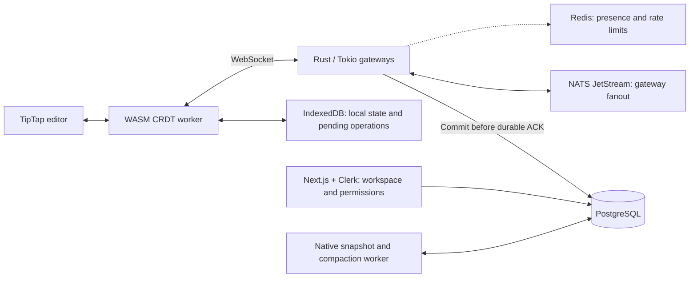
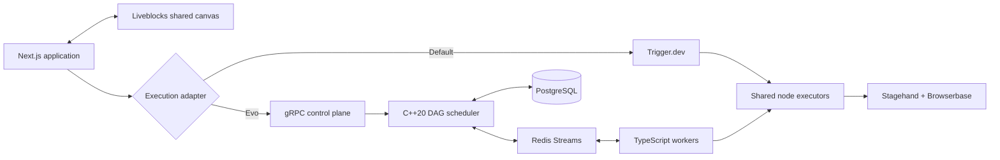

# Utkarsh Khajuria

### Software Engineer · GSoC 2026 @ CGAL · Systems & Full-Stack Engineering

I build collaborative software, distributed workflow engines, and AI developer tools.

  <a href="#about-me">About</a> ·
  <a href="#flagship-projects">Flagship Projects</a> ·
  <a href="#open-source-and-research">Open Source & Research</a> ·
  <a href="#more-projects">More Projects</a> ·
  <a href="#technical-toolbox">Tech Stack</a> ·
  <a href="#connect">Contact</a>

---

## About me

I'm a **Computer Science Engineering student** and **Google Summer of Code 2026 contributor at CGAL**, working on Python bindings for a large C++ computational geometry library.

My projects combine usable products with the systems underneath them: collaborative editing, offline recovery, dependency-aware scheduling, durable execution, browser automation, and authorization. I work across **C++, Rust, Python, TypeScript, and SQL**.

Previously, I worked on **multimodal sentiment analysis at CSIR–Indian Institute of Integrative Medicine**, combining language and video representations.

**Start with [Concord](#1-concord) for collaboration and reliability, then [EvoBrowser](#2-evobrowser) for automation and distributed execution.**

---

## Flagship projects

| Project | What you can use it for | Engineering underneath |
|---|---|---|
| **[1. Concord](#1-concord)** | Write together, work offline, review proposals, manage access, and carry document history between workspaces. | Custom C++20 CRDT, WebAssembly, Rust gateways, durable synchronization, recovery, and offline archive verification. |
| **[2. EvoBrowser](#2-evobrowser)** | Turn a natural-language goal into an editable workflow, collaborate on it, and watch it execute in a cloud browser. | Validated DAGs, a C++20 execution engine, Redis Streams, PostgreSQL, leases, retries, cancellation, and resource-aware scheduling. |

### 1. Concord

**A local-first collaborative document workspace with review branches and verifiable history.**

Concord brings writing, collaboration, review, and recovery into one workspace. Teams can keep editing through a disconnection, review a proposal independently, merge selected changes, and export retained history for verification outside the original server.

**[Repository](https://github.com/UtkarsHMer05/Concord-Dev)** ·
**[Web preview](https://concord-dev.vercel.app)** ·
**[Architecture](https://github.com/UtkarsHMer05/Concord-Dev/blob/main/docs/ARCHITECTURE.md)** ·
**[Documentation](https://github.com/UtkarsHMer05/Concord-Dev/blob/main/docs/README.md)**

`C++20` · `WebAssembly` · `Rust / Tokio` · `Next.js` · `TipTap` · `PostgreSQL` · `NATS JetStream` · `Redis` · `IndexedDB`

**What you can do**

- **Write together:** collaborate on formatted documents with live cursors and selections.
- **Keep working offline:** retain local edits, reload safely, and synchronize after reconnecting.
- **Review before merging:** create a branch, compare changes, discuss them, and merge selected edits.
- **Manage access:** share with viewer, commenter, or editor roles and find documents in **Shared with me**.
- **Keep history portable:** save checkpoints, restore revisions, and verify signed archives offline.
- **Inspect the system:** replay failure traces and reproduce browser performance comparisons.

<b>Explore the complete feature catalog</b>

| Capability | What it does |
|---|---|
| **Document workspace** | Personal and organization documents, templates, title search, pagination, renaming, and permission-checked deletion. |
| **Rich-text collaboration** | Concurrent editing of paragraphs, headings, nested bullet and numbered lists, task lists, links, inline code, and supported text styles, with live cursors and selections. |
| **Offline editing and reconnect** | IndexedDB-backed local state and pending operations survive reloads. Stable operation identities support safe retry and deduplication. Save status distinguishes local persistence, pending changes, and server acknowledgement. |
| **Reconnect briefings** | Catch up on changes made while away from the document. |
| **Safe client upgrades** | Capability negotiation and upgrade checks give incompatible clients an explicit upgrade path while retaining local data. |
| **Review branches** | Start from a named revision, edit independently, manage branch access, compare base/main/proposal, detect conflicts, and merge selected changes while preserving unrelated edits. Merge retries are idempotent. |
| **Comments and suggestions** | Anchored discussions, replies, thread resolution, proposed text changes, and acceptance or rejection. Pending comment actions have an offline outbox. |
| **History, restore, and replay** | Named checkpoints, durable revision previews, restore-as-new-edits, and an inspector for stepping through the browser's operation log. |
| **Sharing and roles** | Share by verified account email, copy restricted document links, change viewer/commenter/editor access, and remove grants. The server enforces permissions on requests, synchronization, and live broadcasts. |
| **Shared with me** | Discover explicitly shared documents across workspaces, search and paginate the list, refresh access information, and open documents with the effective role. |
| **Signed `.concordpack` archives** | Export retained operations, snapshots, and revision provenance; verify offline with a separately trusted signing key; restore into a new private document. Imports include tamper checks and idempotent retry handling. |
| **Markdown and content bundles** | Import/export the supported Markdown subset with loss warnings, inspect local content bundles, and apply supported visible content as new edits. |
| **Installable PWA** | Install the production workspace and reopen previously cached documents and editor assets offline. |
| **Collaboration failure lab** | Inspect disconnections, duplicate delivery, lost acknowledgements, and recovery. View replica states, download traces, replay failures, and minimize a reproduction. |
| **Reproducible browser benchmarks** | Compare Concord and Yjs using identical user edits and a shared durability contract. Inspect rendering, local persistence, committed acknowledgement, memory, retained storage, and offline recovery. |

**Collaboration scope:** tables, images, blockquotes, and code blocks use a separate local-only persistence path. The concurrent CRDT path covers the documented rich-text subset.

**Sharing scope:** invitations target existing verified accounts. Organization membership contributes to effective permissions, and review branches have separate access controls.

**Archive scope:** exports preserve retained history. Restoring an archive creates a private copy; original permissions, comments, and branch relationships are not recreated.

[Rich-text guide](https://github.com/UtkarsHMer05/Concord-Dev/blob/main/docs/RICH_TEXT_COLLABORATION.md) ·
[Review branches](https://github.com/UtkarsHMer05/Concord-Dev/blob/main/docs/REVIEW_BRANCHES.md) ·
[Sharing](https://github.com/UtkarsHMer05/Concord-Dev/blob/main/docs/SHARING.md) ·
[Signed archives](https://github.com/UtkarsHMer05/Concord-Dev/blob/main/docs/CONCORDPACK.md) ·
[Failure lab](https://github.com/UtkarsHMer05/Concord-Dev/blob/main/docs/FAILURE_LAB.md)

<b>Open the product gallery: sharing, discovery, and review</b>

**Share a document and manage roles**

**Find documents in Shared with me**

**Compare the base, current document, and review proposal**

<b>Explore the synchronization architecture</b>

The browser applies edits locally and retains pending operations until the gateway acknowledges their PostgreSQL commit. Reconnects resend stable operation identities, allowing the server to deduplicate retries.

NATS distributes committed changes between gateways. Redis supports ephemeral state. Native workers build snapshots and compact retained operation history for recovery.

[Architecture](https://github.com/UtkarsHMer05/Concord-Dev/blob/main/docs/ARCHITECTURE.md) ·
[Consistency model](https://github.com/UtkarsHMer05/Concord-Dev/blob/main/docs/CONSISTENCY_MODEL.md) ·
[Recovery](https://github.com/UtkarsHMer05/Concord-Dev/blob/main/docs/RECOVERY.md)

<b>Inspect verification and benchmark evidence</b>

Verification includes native/WASM parity, randomized CRDT convergence, fuzzing, sanitizers, PostgreSQL integration, gateway recovery, and authenticated browser journeys covering editing, upgrades, branch merges, and sharing.

The recorded sharing verification includes **315 passing web tests** and **83 passing database tests**.

**Historical gateway and recovery measurements**

Recorded on an **Apple M2 with 8 GB RAM**, Release builds, and loopback services at commit `eee94b9`.

| Workload | Recorded result |
|---|---|
| Durable acknowledgement, 25-operation ingest microbenchmark | p50 **31.45 ms → 2.72 ms** after batching |
| Throughput in the same ingest microbenchmark | **771 → 8,685 operations/s** |
| Recovery of a 100,000-operation history, five-run p50 | **61.36 s → 0.964 s** using a snapshot and 1,000-operation tail |

These historical measurements describe specific ingest and recovery workloads. Later editor features have their own browser measurements.

**Browser comparison with Yjs**

The recorded campaign uses **three measured runs plus one excluded warmup**, **5,364 measured user edits**, real Chromium, and the same PostgreSQL commit boundary for both engines.

| Shared measurement | Concord | Yjs |
|---|---:|---:|
| Append input to rendering opportunity, p95 | 34.40 ms | 33.20 ms |
| Large paste to local durability, p95 | 2,315.40 ms | 4.90 ms |

The comparison makes current costs visible, including large-paste persistence and retained history size. All **64 paired cases**, including warmups, and **three authenticated app trials** passed convergence, durability, and reload checks.

[Benchmark methodology](https://github.com/UtkarsHMer05/Concord-Dev/blob/main/docs/BENCHMARKS.md) ·
[Browser comparison and reproduction](https://github.com/UtkarsHMer05/Concord-Dev/blob/main/docs/PERFORMANCE_COMPARISON.md) ·
[Testing guide](https://github.com/UtkarsHMer05/Concord-Dev/blob/main/docs/TESTING.md)

---

### 2. EvoBrowser

**AI-planned browser automation on a collaborative workflow canvas.**

Describe a goal, inspect the generated workflow, edit it with teammates, and explicitly press **Run**. EvoBrowser executes the workflow in a cloud browser while showing progress, logs, extracted data, screenshots, and session replay.

The product supports a default **Trigger.dev runtime** and an optional **custom C++20 distributed execution engine** through the same workflow and UI contract.

**[Repository](https://github.com/UtkarsHMer05/EvoBrowser)** ·
**[Web preview](https://evo-browser-nine.vercel.app)** ·
**[Architecture](https://github.com/UtkarsHMer05/EvoBrowser/blob/main/docs/phase2/ARCHITECTURE.md)** ·
**[Engineering evidence](https://github.com/UtkarsHMer05/EvoBrowser/blob/main/docs/phase2/RESUME_EVIDENCE.md)**

`C++20` · `Next.js` · `TypeScript` · `React Flow` · `Liveblocks` · `gRPC` · `Redis Streams` · `PostgreSQL` · `Stagehand` · `Browserbase`

**What you can do**

- **Plan with AI:** turn a natural-language goal into a validated, editable workflow.
- **Build together:** collaborate on nodes and edges with shared graph state, presence, and cursors.
- **Watch execution:** follow the live browser, visual action overlays, node progress, and logs.
- **Use the results:** inspect structured outputs, screenshots, and replay; pass data between nodes.
- **Control a run:** start explicitly, stop execution, and rerun with a fresh browser session.
- **Explore the engine:** inspect scheduling, retries, worker recovery, cancellation, and tenant fairness.

<b>Explore the complete product feature catalog</b>

| Capability | What it does |
|---|---|
| **AI workflow planner** | Uses the registered node catalog to generate structured plans. Schema and graph validation check node identities, edges, the Start node, and cycles before execution. |
| **Editable visual builder** | React Flow canvas, node palette, drag-and-drop editing, configurable fields, connections, deterministic layout, and pre-run validation. |
| **Real-time collaboration** | Liveblocks-backed shared graph state, presence, cursors, and selections in organization-scoped rooms. |
| **Cloud browser automation** | Stagehand V3 executes browser nodes in Browserbase, with one browser session per run. |
| **Live browser view** | Authorized viewing through server routes, with a bounded viewer handshake before watched execution begins. |
| **Visual action overlays** | In-page highlights for navigation, action targets, observation matches, extraction, and agent activity. |
| **Data flow between nodes** | Resolve references such as `{{ nodeId.path }}`, including nested fields and array values. Registry-derived suggestions help configure inputs. |
| **Run controls** | Explicit Run, idempotent Stop, cancellation propagation, fresh-session reruns, and engine-neutral status reporting. |
| **Logs and results** | Per-node status, timings, logs, errors, outputs, run duration, node counts, final URL, and final screenshot. |
| **Session replay** | HLS playback through an authorized server proxy. Replay is Pro-gated. |
| **Agent node** | Goal-driven browser work through Stagehand's agent capability. The Agent node is Pro-gated. |
| **Email workflows** | Send Email nodes can use data produced by earlier workflow steps through the server-side Resend integration. |
| **Identity and organizations** | Clerk authentication, organization-scoped access, billing entitlements, and server-side plan checks. |
| **Persistence and observability** | Application persistence through Neon/PostgreSQL and Drizzle, organization-authorized artifacts, Sentry instrumentation, and engine metrics. |

Generated workflows require an explicit Run action. The planner uses the supported node catalog, and unsupported goals receive explicit feedback.

<b>Explore all seven workflow nodes</b>

| Node | Purpose |
|---|---|
| **Start** | Defines the workflow entry point. |
| **Open URL** | Navigate the browser to a configured or interpolated URL. |
| **Act** | Perform a natural-language browser action. |
| **Extract** | Return structured information from a page. |
| **Observe** | Identify possible actions and matching page targets. |
| **Agent — Pro** | Execute a broader browser goal through Stagehand's agent runtime. |
| **Send Email** | Send an email using configured content and workflow data. |

<b>Explore the two execution architectures</b>

| Concern | Default runtime | Evo engine |
|---|---|---|
| **Scheduler** | Trigger.dev durable task | Custom C++20 dependency-aware DAG scheduler |
| **Execution order** | Sequential topological execution | Concurrent ready branches where dependencies and resource capacity permit |
| **Task transport** | Trigger.dev runtime | Redis Streams |
| **Control plane** | Application adapter | Protobuf and gRPC |
| **Durable engine state** | Trigger-managed runtime plus application artifacts | PostgreSQL run, node, attempt, lease, and idempotency state |
| **Node implementation** | Shared TypeScript executors | The same executors through TypeScript workers |
| **Browser behavior** | One session per run | One session per run, with same-run browser actions serialized |

**Inside the Evo engine**

- **Dependency-aware scheduling:** unlock downstream nodes after successful durable results, and run independent ready work concurrently.
- **Resource affinity:** serialize browser work within a run and enforce configured resource capacities across runs.
- **Durable execution state:** persist workflow versions, runs, nodes, attempts, leases, idempotency records, and artifacts.
- **At-least-once transport:** task, result, control, and event streams use consumer groups, with guards against duplicate or late logical results.
- **Retries and dead letters:** bounded exponential backoff with jitter and terminal failure handling.
- **Worker recovery:** lease expiry and reconciliation recover work after a worker crash.
- **Scheduler recovery:** rebuild active state from PostgreSQL and drain pending results after restart.
- **Cancellation:** propagate Stop from the application through the control plane, scheduler, worker, and cooperative browser execution.
- **Tenant admission:** optional organization quotas, global resource capacities, and deferred ready work under backpressure.
- **Weighted fairness:** optional weighted least-served scheduling for contended resource classes.
- **Observability:** Prometheus metrics, structured logs, Sentry, and authorized artifact access.

Retries for side-effecting external I/O require an idempotency strategy. Duplicate-result suppression protects logical application; external side effects retain their own delivery semantics.

[Engine architecture](https://github.com/UtkarsHMer05/EvoBrowser/blob/main/docs/phase2/ARCHITECTURE.md) ·
[Failure model](https://github.com/UtkarsHMer05/EvoBrowser/blob/main/docs/phase2/FAILURE_MODEL.md) ·
[System design notes](https://github.com/UtkarsHMer05/EvoBrowser/blob/main/docs/phase2/SYSTEM_DESIGN_NOTES.md)

<b>Inspect benchmark and recovery evidence</b>

Reference environment: **Apple M2, 8 cores, Darwin arm64, Apple clang 21, Release build**.

The performance measurements below use **synthetic local scheduler tasks**. Browserbase execution and LLM latency have separate workloads.

| Recorded experiment | Result | Measurement scope |
|---|---|---|
| Concurrent local scheduling | **8.01×** at eight threads versus the sequential reference | Simulated I/O-bound C++ DAG tasks |
| Distributed result batching | Median **107.8 → 182.3 tasks/s**, a **69% increase** | 500 synthetic tasks, one worker, two trials per cell |
| Durable task audit | **Zero lost or duplicated logical tasks** in the recorded campaign | 100-, 500-, and 1,000-task DAGs across one, two, and four workers |
| Worker crash recovery | **6.468 s median**, with recovery in all seven trials | Lease-holding worker terminated with SIGKILL |
| Short service interruptions | **30/30 tasks completed** for both injected Redis and PostgreSQL pauses | Controlled pauses within the reconnect budget |

The repository documents graph-shape effects, coordination overhead, worker-count behavior, fairness measurements, and recovery limits alongside the positive results.

[Evidence registry](https://github.com/UtkarsHMer05/EvoBrowser/blob/main/docs/phase2/RESUME_EVIDENCE.md) ·
[Benchmark methodology](https://github.com/UtkarsHMer05/EvoBrowser/blob/main/docs/phase2/BENCHMARK_METHODOLOGY.md) ·
[Historical scheduler benchmark](https://github.com/UtkarsHMer05/EvoBrowser/blob/main/docs/phase2/LOCAL_SCHEDULER_BENCHMARK.md)

<b>Open the product gallery: execution and structured extraction</b>

**Follow logs and inspect outputs**

**Configure an extraction node**

---

## Open source and research

### Google Summer of Code 2026 — CGAL

**Contributor · Python bindings for the Computational Geometry Algorithms Library**

My CGAL work connects template-heavy C++ geometry APIs with Python-facing bindings, documentation, packaging, and cross-platform build workflows.

- Worked across **32 computational geometry modules**.
- Built an automated **Doxygen XML → JSON → C++ docstrings** pipeline.
- Implemented Python-friendly **Named Parameters** support.
- Worked with **modern C++, Python, and nanobind** on binding infrastructure.
- Improved Python API documentation and usability.
- Added and validated package/configuration workflows across **Linux, macOS, and Windows**.

**[CGAL](https://www.cgal.org/)** · **[CGAL repository](https://github.com/CGAL/cgal)**

### CSIR–Indian Institute of Integrative Medicine

**Former Technical Research Intern · Multimodal sentiment analysis**

- Worked with **BERT** text representations, **ResNet3D** visual/video features, and **1D-CNN** architectures.
- Performed preprocessing, experimentation, and evaluation using **Python, PyTorch, and AWS SageMaker**.

---

## More projects

### RazorMesh Trust

**Authorization infrastructure for agentic commerce**

A research prototype exploring how AI-driven commerce can preserve human authorization through deterministic enforcement and context-bound execution.

- Normalized **AgentCommerceIR** and deterministic policy checks.
- Semantic contradiction detection and conservative decision fusion.
- Context-bound execution tickets, idempotent execution, and replay protection.
- Tamper-evident audit evidence.
- Model output remains non-authoritative: AI proposals cannot mint payment authority.

`FastAPI` · `PostgreSQL` · `Redis` · `Next.js` · `PyTorch / Transformers`

**[Repository](https://github.com/UtkarsHMer05/RazorMesh)**

### Vertex

**An AI-powered development environment in the browser**

Combines an AI coding agent, a CodeMirror editor, terminal emulation, WebContainers, real-time Convex state, background jobs, and live documentation ingestion.

`Next.js` · `TypeScript` · `Convex` · `Clerk` · `Inngest` · `CodeMirror` · `WebContainers` · `Firecrawl`

**[Repository](https://github.com/UtkarsHMer05/vertex)** · **[Web preview](https://vertex-indol-eight.vercel.app)**

### Cortex

**An AI customer support platform**

Combines **RAG-powered chat**, **voice AI**, and **human handoff** in a unified support workflow.

`Next.js` · `React` · `Convex` · `Gemini` · `Vapi` · `Clerk` · `AWS Secrets Manager` · `Turborepo`

**[Repository](https://github.com/UtkarsHMer05/cortex)** · **[Web preview](https://cortex-landing-omega.vercel.app)**

---

## Technical toolbox

| Area | Tools and concepts used in my work |
|---|---|
| **Languages** | C++, Rust, Python, TypeScript, JavaScript, SQL |
| **Systems engineering** | C++20, concurrency, DAG scheduling, CRDTs, WebAssembly, CMake, gRPC, Protocol Buffers |
| **Web and developer tools** | Next.js, React, TipTap, React Flow, CodeMirror, WebContainers |
| **Data and messaging** | PostgreSQL, Neon, Drizzle, Redis Streams, NATS JetStream, IndexedDB, Convex |
| **AI and automation** | PyTorch, Transformers, BERT, Gemini, RAG, Stagehand, Browserbase, Firecrawl |
| **Identity and workflows** | Clerk, Liveblocks, Trigger.dev, Inngest, Resend |
| **Cloud and observability** | Docker, AWS SageMaker, AWS Secrets Manager, Prometheus, Sentry, GitHub Actions |
| **Verification** | Native/WASM parity, fuzzing, sanitizers, integration tests, browser journeys, failure injection, reproducible benchmarks |

---

## Achievements

- **Google Summer of Code 2026 contributor — CGAL**
- **2× National Hackathon Winner**

---

## How I approach engineering

- **Preserve user work:** make local persistence, synchronization, acknowledgement, and recovery explicit.
- **Make retries safe:** design operation identities, durable state, and idempotency around real failure paths.
- **Keep authority explicit:** enforce permissions on the server and define what AI output is allowed to influence.
- **Measure defined workloads:** publish the environment, comparison baseline, recovery behavior, and limitations with each result.
- **Make complex systems usable:** pair the engine with interfaces that expose progress, failures, and next actions clearly.

---

## Connect

I'm happy to talk about software engineering, open source, distributed systems, developer tools, AI/ML, research, and internships.

**[Email](mailto:utkarshkhajuria55@gmail.com)** ·
**[LinkedIn](https://www.linkedin.com/in/utkarshkhajuria05)** ·
**[GitHub](https://github.com/UtkarsHMer05)** ·
**[Instagram](https://instagram.com/utkarshk_05)**

[Explore all repositories](https://github.com/UtkarsHMer05?tab=repositories) · [Back to top](#utkarsh-khajuria)

